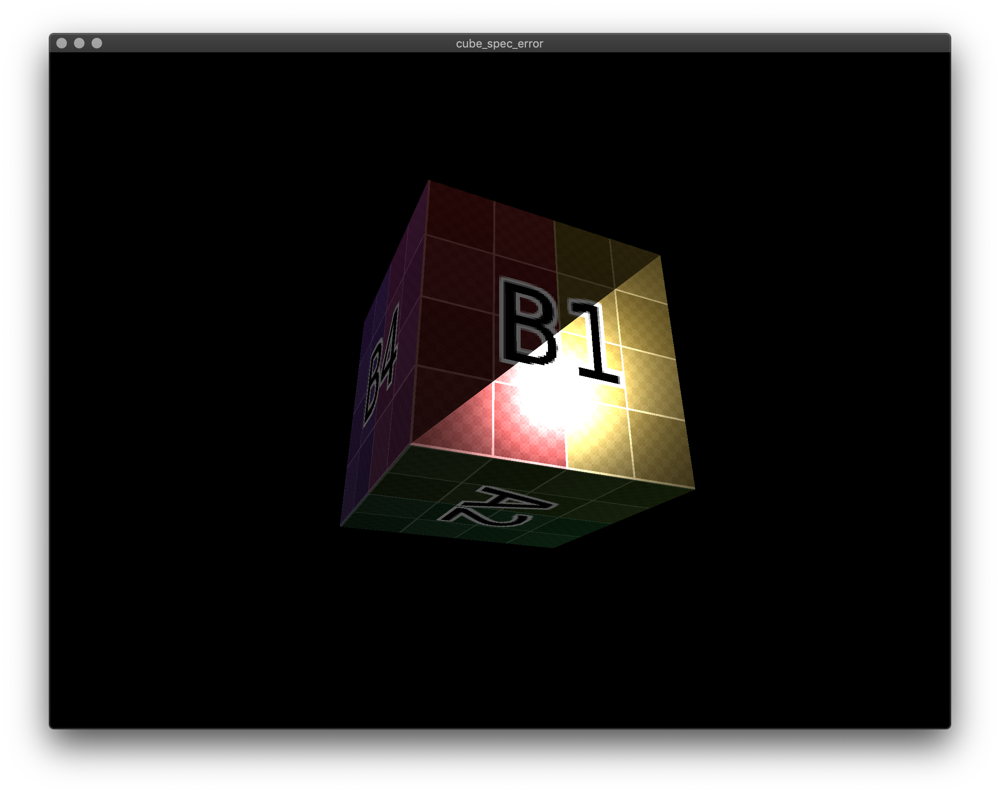
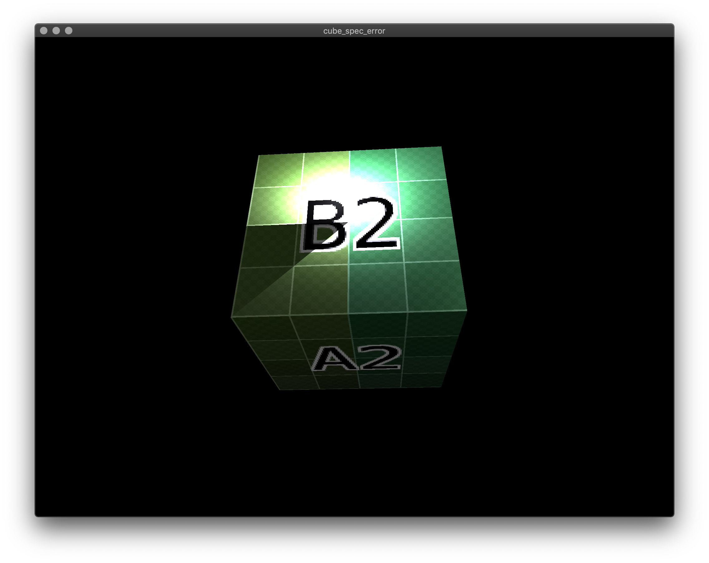
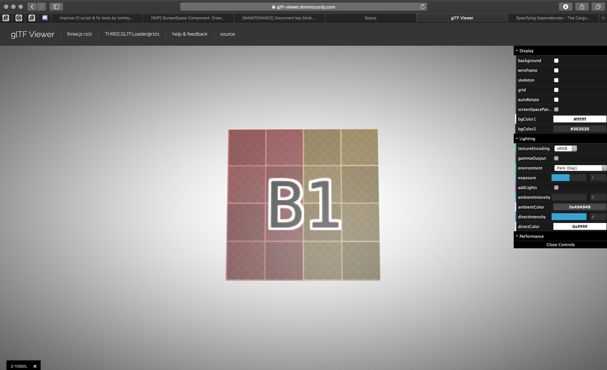
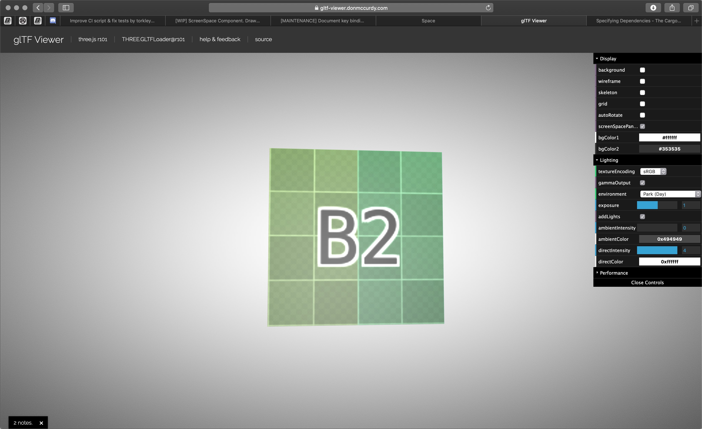

# Specular Lighting Error

When loading the gltf files, it appears that the specular lighting is not being calculated correctly along some faces.

For example the file [resources/cube.gltf](resources/cube.gltf) created from a default cube mapped in blender.  With metallic of 0.0, and roughness of 0.5.

In Amethyst there are triangles that have what appears to be no specular lighting.  And the roughness appears too low.

However the specular lighting is displayed correctly in Don McCurdy's GLTF viewer https://gltf-viewer.donmccurdy.com

